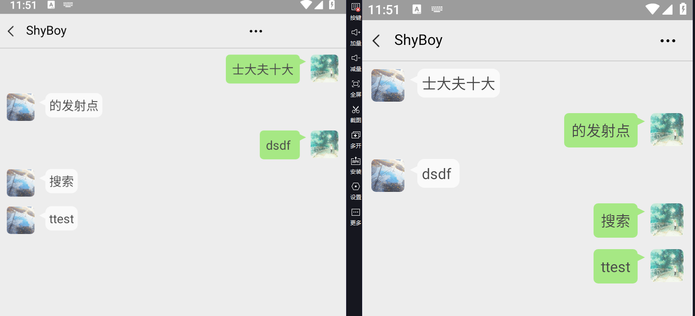
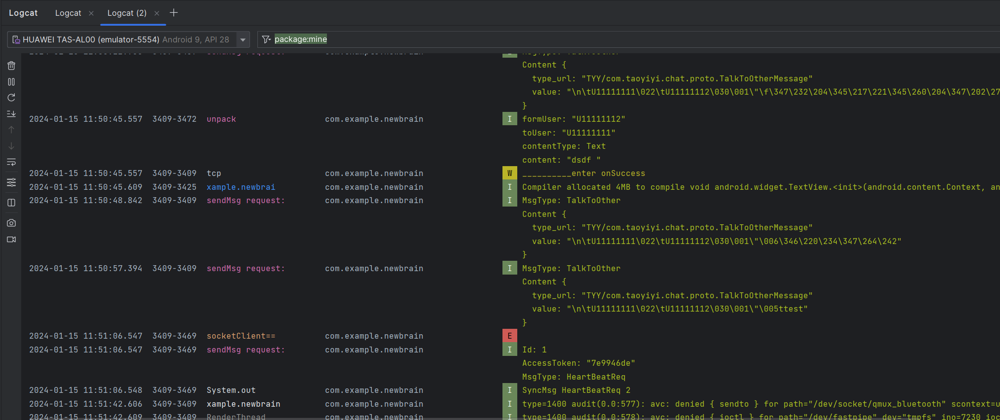
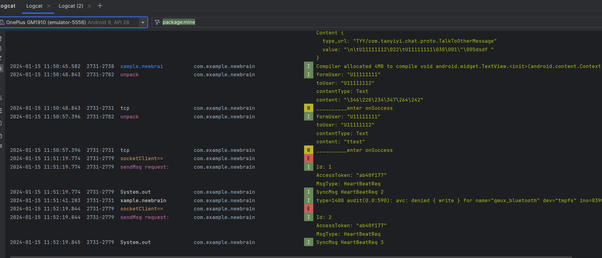
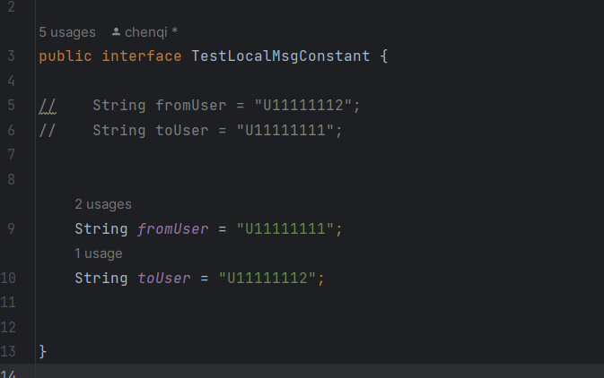

# NewBrain

#### 介绍
仿照微信聊天界面的APP，使用socket通信，可以建立后端socket链接即可实现聊天对话，此APP实现聊天所需的界面。

#### 软件架构
此APP采用基于Socket的Tcp连接进行通信，通过简单的IP地址加端口即可建立简单连接。最初项目连接后端python服务器后，可以建立一个人机对话系统，如果需要实现两人对话则只需改动部分代码，即转发的信息为另一个连接人的信息。

#### 运行环境

1. Android开发
Android Studio 4.1.2
2. 客户端运行环境：
Android 7.0

#### 界面截图展示

1. 聊天界面

    

#### 参与贡献

1.  Aiden
2.  Moxing

#### 修改
1. protobuf+netty 通讯
2. handler 传递数据给mianThread
 ### [服务端地址](https://github.com/chenqi199/chat-backend)

不同设备启动需要切换注册用户用户

